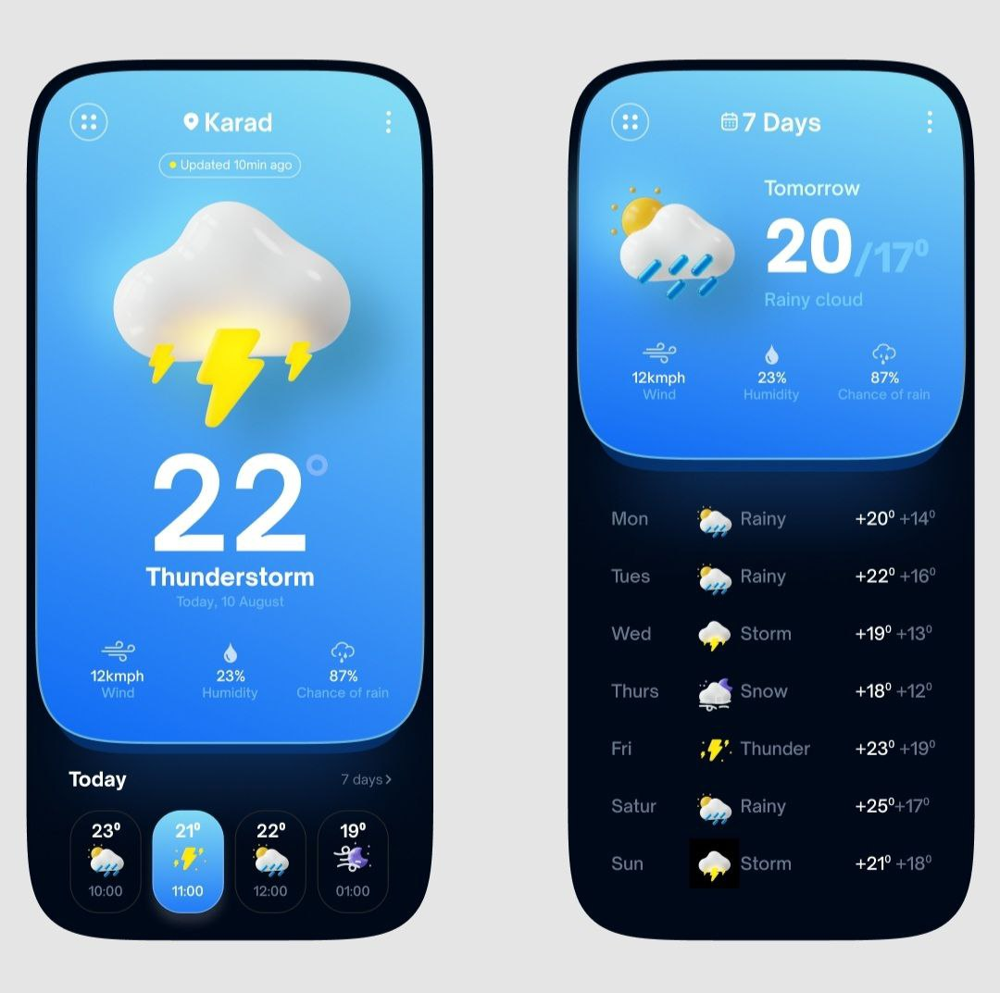
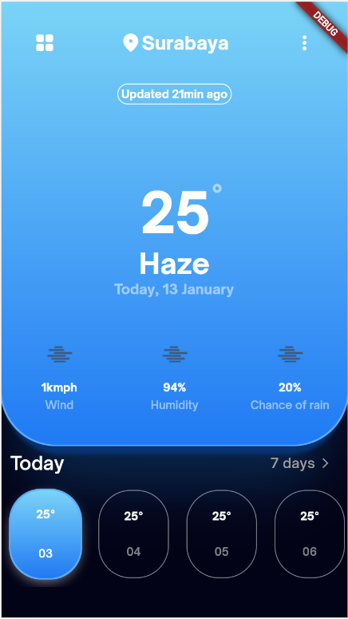
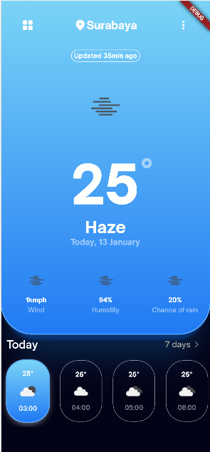
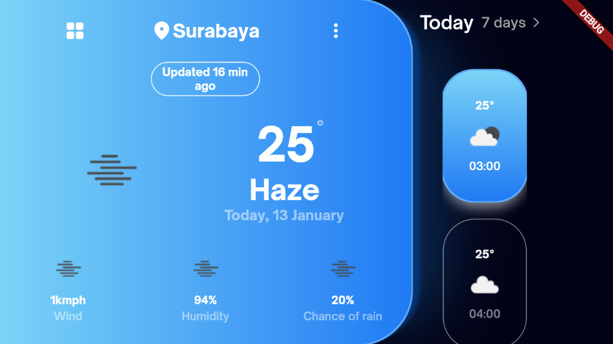
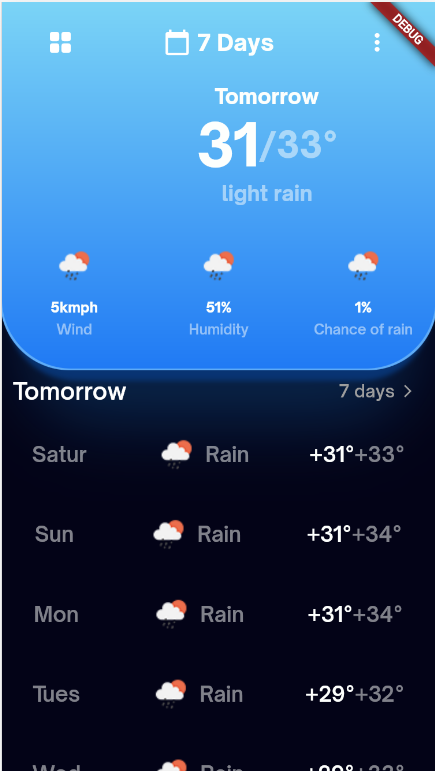
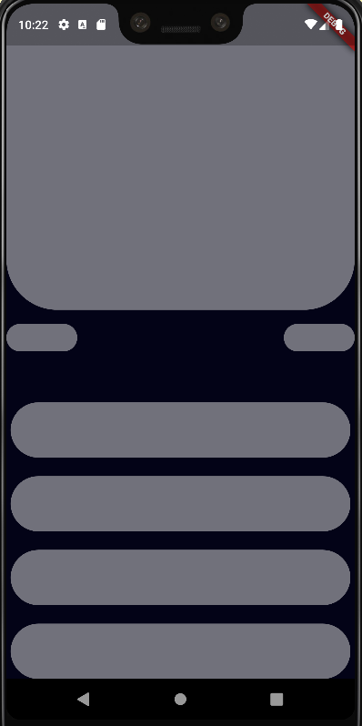
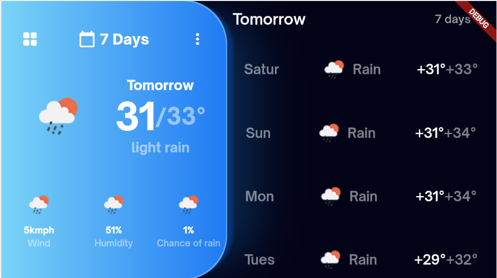
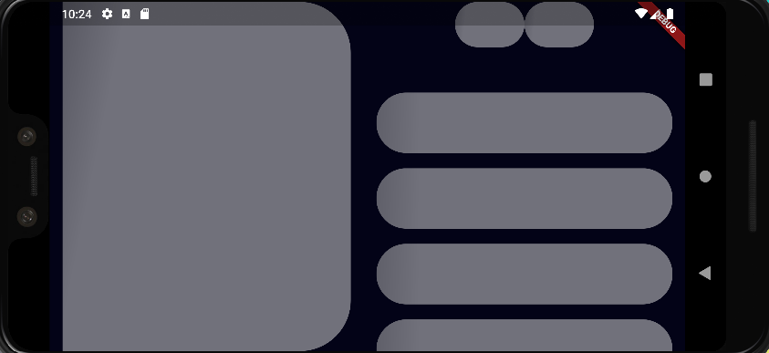

# Aplikasi Cuaca Sederhana

## Deskripsi Aplikasi

Design Awal Aplikasi :

Design awal aplikasi ini saya gunakan sebagai inspirasi untuk aplikasi yang akan saya buat dan kembangkan lagi.

Pembuatan aplikasi ini bertujuan untuk mengisi waktu luang saja, dan biasa codenya saya gunakan sebagai contoh ketika mengajarkan tentang fetch data dasar dan tentang pembuatan componen UI yang reusable yang saat ini saya pahami, selain itu dalam projek sederhana ini, saya ingin menerapkan UI responsive yang dapat digunakan di device mobile terkecil hingga tablet, dan dapat digunakan baik di mode landscape atau mode portrait dengan desain yang berbeda.

Adapun kekurangan dari aplikasi ini :
- Masih ada beberapa device yang mengalami UI overflowed.
- UI masih belum support di device tablet dan smartwatch.

Untuk penerapan UI aplikasi di device tablet dan smartwatch, akan menjadi target kedepannya.

Untuk data, saya mengambilnya dari api.openweathermap.org.

## Fitur Aplikasi
### Page 1
- Melihat informasi Cuaca hari ini, seperti : waktu, suhu, informasi angin, informasi kemungkinan hujan, icon yang sesui cuaca.
- Melihat informasi Cuaca 9 jam kedepan, informasinya berupa, waktu, suhu, icon yang sesuai cuaca.

### Page 2
- Melihat informasi Cuaca yang akan terjadi besok.
- Melihat informasi Cuaca yang akan terjadi 1 minggu kemudian.

### Lainnya
- Aplikasi sudah dapat dilihat dalam mode portrait dan landscape dengan design yang cocok.

## Aplikasi
### Page 1
#### Page Cuaca 1 Portrait

#### Page Cuaca 1 Portrait Loading

#### Page Cuaca 1 Landscape

#### Page Cuaca 1 Landscape Loading

### Page 2
#### Page Cuaca 2 Portrait

#### Page Cuaca 2 Portrait Loading

#### Page Cuaca 2 Landscape

#### Page Cuaca 2 Landscape Loading

